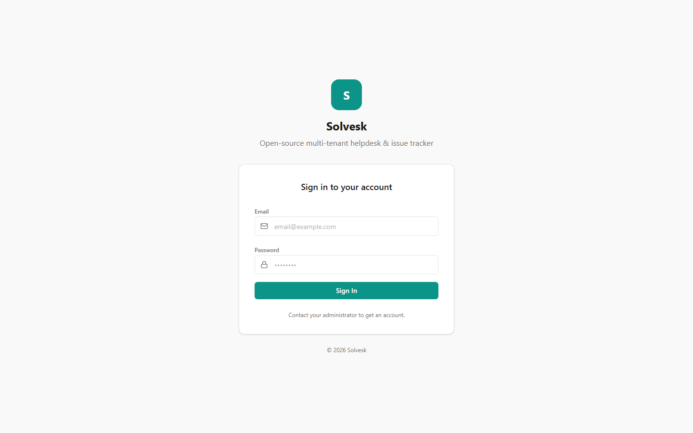
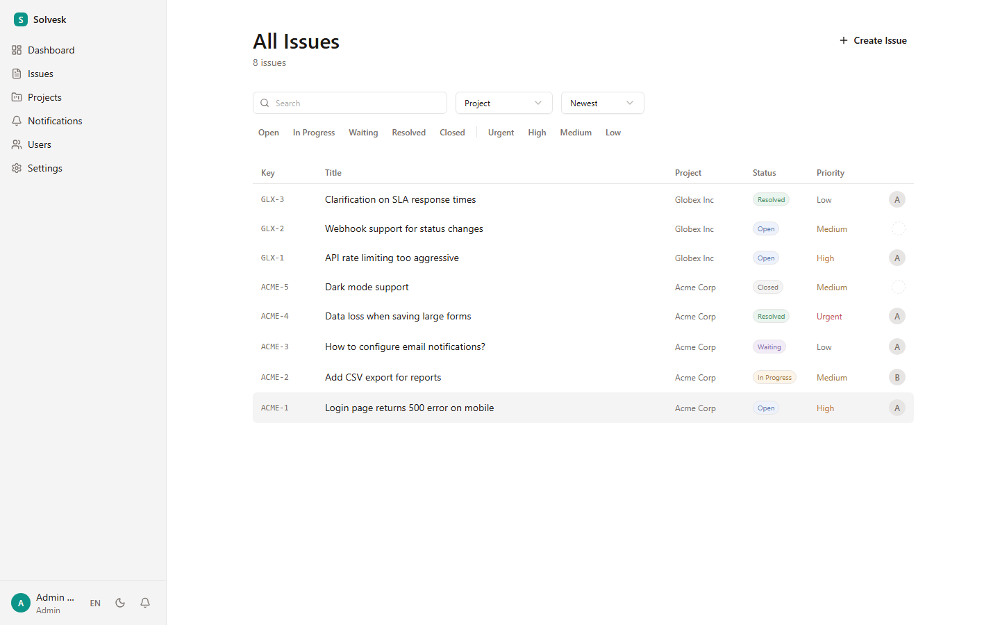

# Solvesk

Open-source multi-tenant helpdesk and issue tracker with row-level tenant isolation, 3-tier RBAC, and a built-in customer portal.

**[Live Demo](https://solvesk.vercel.app)** | admin@demo.com / password123





## Features

- **Multi-tenant isolation** — Row-level project isolation with strict access controls
- **3-tier RBAC** — Admin, Agent, Customer with fine-grained permissions
- **Customer portal** — Customers create/track issues, see only their project's public issues
- **Issue tracking** — 5 statuses, 4 priorities, labels, due dates, assignees
- **Rich text editor** — Tiptap with code blocks, tables, images, mentions
- **Internal notes** — Comments hidden from customers
- **Pseudonym masking** — Staff names masked for customer-facing views
- **Notifications** — In-app notifications for assignments, status changes, comments
- **Dark mode** — System/light/dark theme
- **i18n** — English and Korean with `next-intl`

## Tech Stack

| Layer     | Technology                  |
| --------- | --------------------------- |
| Framework | Next.js 15 (App Router)     |
| Database  | PostgreSQL + Drizzle ORM    |
| Auth      | NextAuth.js (Credentials)   |
| UI        | Tailwind CSS v4 + shadcn/ui |
| State     | Zustand + React Query       |
| i18n      | next-intl                   |

## Quick Start

### Prerequisites

- Node.js 20+
- pnpm 9+
- Docker (for PostgreSQL)

### Setup

```bash
git clone https://github.com/IMMINJU/solvesk.git
cd solvesk
pnpm install

# Start database
docker compose up -d postgres

# Configure
cp .env.example .env

# Push schema & seed
pnpm db:push
pnpm db:seed

# Run
pnpm dev
```

Open http://localhost:3000 and sign in:

| Email              | Role     | Password    |
| ------------------ | -------- | ----------- |
| admin@demo.com     | Admin    | password123 |
| agent1@demo.com    | Agent    | password123 |
| customer1@demo.com | Customer | password123 |

### Docker

```bash
git clone https://github.com/IMMINJU/solvesk.git
cd solvesk
cp .env.example .env
echo "NEXTAUTH_SECRET=$(openssl rand -base64 32)" >> .env

docker compose up -d
```

On first launch, you'll be guided to create your admin account.

## Architecture

```
src/
  app/[locale]/       Pages (locale-prefixed routing)
  app/api/            API routes (~30 endpoints)
  features/           Feature modules (issue, project, user, notification, label, dashboard)
  components/         Shared UI components
  lib/                Auth, permissions, errors, utilities
  db/                 Drizzle schema (12 tables)
  config/             App config, limits
  i18n/               next-intl config
```

### Role System

| Role     | Project Access          | Key Permissions                     |
| -------- | ----------------------- | ----------------------------------- |
| Admin    | All projects            | Full CRUD, user management          |
| Agent    | Assigned projects (M:N) | Issue handling, internal comments   |
| Customer | Own project (1:1)       | Create/view issues, public comments |

### Customer Isolation

- Customers see only their project's public issues + their own issues
- Private issues (`isPrivate`) hidden from non-reporters
- Internal comments (`isInternal`) never shown to customers
- Status changes restricted to `resolved` only

## Testing

```bash
pnpm test                # Unit tests (Vitest)
pnpm test:integration    # Integration tests (real PostgreSQL)
pnpm test:e2e            # E2E tests (Playwright)
```

| Layer       | Tests | Coverage                                                         |
| ----------- | ----- | ---------------------------------------------------------------- |
| Unit        | 302   | Services, API handlers, permissions, config                      |
| Integration | 152   | RBAC matrix, customer/agent isolation, notifications, audit logs |
| E2E         | 167   | Full user flows for Admin, Agent, and Customer roles             |

## Scripts

```bash
pnpm dev             # Dev server
pnpm build           # Production build
pnpm db:push         # Push schema
pnpm db:seed         # Seed demo data
pnpm db:studio       # Drizzle Studio GUI
pnpm db:generate     # Generate migrations
pnpm db:migrate      # Run migrations
```

## License

[AGPL-3.0](./LICENSE)
